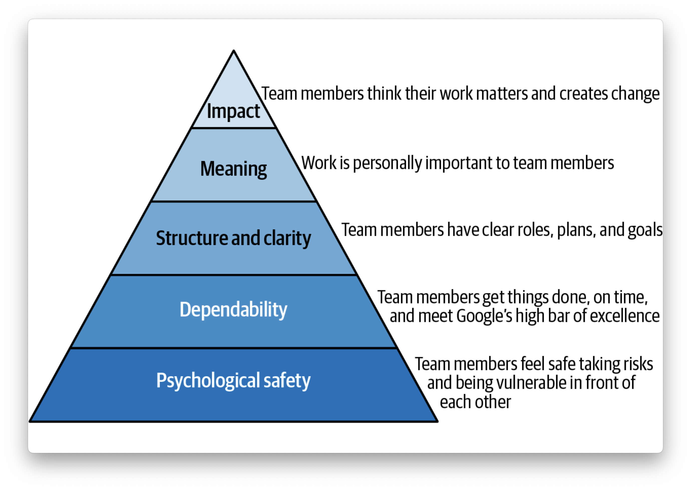
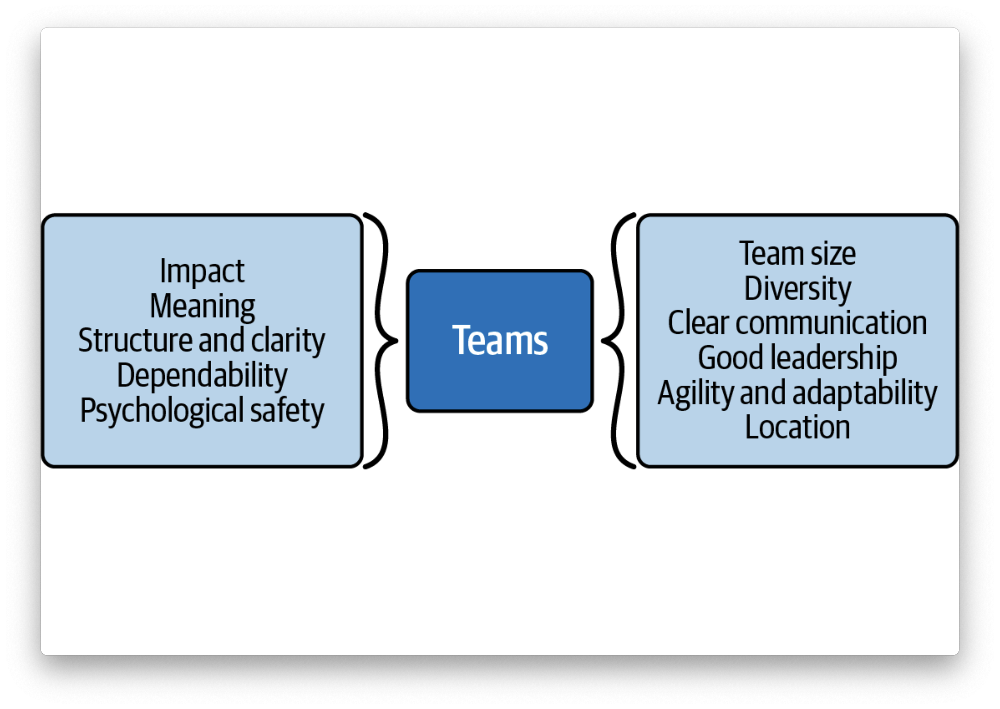

# Chapter 1 - What Makes a Software Engineering Team Effective?

## 🔍 Project Aristotle — 5 Key Dynamics of Effective Teams (Google)

> “Effective teams aren’t just collections of great individuals — they’re environments where people feel safe, aligned, and empowered.”  
> — Addy Osmani, *Leading Engineering Teams*

Google's **Project Aristotle** was a multi-year (2012-2015) internal research project that aimed to answer one key question:  
**“What makes a team effective?”**

They analyzed 180+ teams and identified **5 key dynamics** that consistently appeared in the most successful ones.

---

## ✅ 1. Psychological Safety  
**“Can we take risks on this team without feeling insecure or embarrassed?”**

- **The most critical factor**.
- Team members feel safe to speak up, ask questions, admit mistakes, and suggest ideas without fear of retrubution or criticism.
- Encourages innovation, honesty, and feedback culture.

## ✅ 2. Dependability  
**“Can we count on each other to do high-quality work on time?”**

- Everyone delivers consistently.
- Builds mutual trust and respect.

## ✅ 3. Structure & Clarity  
**“Are goals, roles, and execution plans clear?”**

- Everyone understands the project's goal and knows what’s expected of them.
- Tend to be productive and focused.

## ✅ 4. Meaning of Work  
**“Are we working on something that feels personally important to each of us?”**

- Personal connection to the mission or the problem space.
- Teams perform better when individuals care about what they’re building.

## ✅ 5. Impact of Work  
**“Do we believe the work we’re doing matters?”**

- Understanding how our work contributes to a larger purpose.
- Helps engineers feel motivated and proud of their output.

This framework is foundational for every engineering team — regardless of stack, company size, or domain.

<figure>

<figurecaption>Figure 1-1. Project Aristotle</figurecaption>
</figure>

## Other Research

* Smaller teams are better
* Devirsity can be benefical
* Clear communication is vital
* Leadrship matters
* Agility enables adaptility
* Collocation powers innovation

<figure>

<figurecaption>Figure 1-2. Factors that affect teams</figurecaption>
</figure>

## Motivation Drive Performance

* Authonomy - is the desire to be self-directed and own one’s work. Tend to be more engaged and motivated.
* Mastery - is the desire to improve one’s skills and craftsmanship continuously.
* Purpose - is the desire to do something meaningful and vital.

Example:

* Let team members lead the development of individual modules so that they can develop autonomy and a sense of ownership.
* Help team members get access to the latest tools that will help them productively master the technology they are working on.
* Articulate how their contributions directly impact organizational goals so that they have a meaningful purpose.

----

## Building an Effective Team

Regardless of whether you are working with an existing team, hiring new team members, or doing a mix of both, effective team building would usually require that you do the following:

1. Assemble the right people.
2. Enable a sense of team spirit.
3. Lead effectively.
4. Sustain effectiveness (a growth culture).

### Assemble the Right People

* Hiring and interviewing for effectiveness
* Size
* Shared engineering's mindset
  * Cares about user
  * A good problem solver
  * Can keep things simple but cares about quality
  * Can build trust over time
    * Authonomy
    * Social capital
  * Understand team strategy
  * Can prioritize appropriately and execute independently
  * Can think long term
  * Can leave projects in better shape (if time allows)
  * Is comfortable taking on new challanges
  * Can communicate effectively
* Diversity and inclusion

### Enable a Sense of Team Spirit

* Define roles and responsibilities
* Establish a shared purpose
  * Communicate the overall project purpose and goals
  * Encourage team members to share their ideas and feedback
  * Ensure that all team members understand how their work fits in with what their teammates are doing and into the larger project goals
* Foster trust among team members

## Lead Effectively

### Responsibilities of effective leaders

* You are responsible for planning team roles and composition.
* You help to set goals and priorities for the group/team members.
* You ensure that everyone has what they need (tools/resources) to complete tasks effectively.
* You leverage your experience to provide insights into where issues may arise so they can be proactively addressed before they cause significant problems.
* You establish clear lines of communication using tools and processes that promote effective communication.
* You communicate regularly via team meetings, status updates, and progress reports. Communication should be timely, transparent, and inclusive.

### Strategic visibility

*Strategic visibility* is about communicating the team’s accomplishments and their impact on the business to internal and external stakeholders.

As a leader you should do the following:

* **Align with broader objectives** - Your work’s impact multiplies when it aligns with your organization’s primary goals.
* **Leverage your team’s unique strengths** - Understand and utilize the unique skills and knowledge of your team.
* **Communicate effectively** - Regularly share your progress and learnings. Transparency fosters recognition and collaboration.
* **Focus on impact, not just hard work** - It’s not just about working hard but also about creating tangible impacts that align with organizational priorities.
* **Build a narrative around your work** - Document and share your journey; it’s crucial for visibility and recognition.

## Conclusion

Project Aristotle and other research on effective teams showed that enabling psychological safety, clarity of structure and communication, dependability, meaningful work, and agility can create an environment conducive to collaboration, innovation, and success. These factors recur throughout the chapter and bind teams together in their drive to be effective.

Effective teams share certain qualities or dynamics that enable them to be effective. Their performance is also driven by motivation. Therefore, to build an a new team that will be effective or develop an existing team to make it more effective, you must take certain factors into consideration. These factors include composing your team with the right number of people for a project, with diverse skill sets and backgrounds. It also includes developing an engineering mindset in each member, which creates a synergy that eases the way for collaboration and effective performance. This is further cemented by a sense of team spirit.