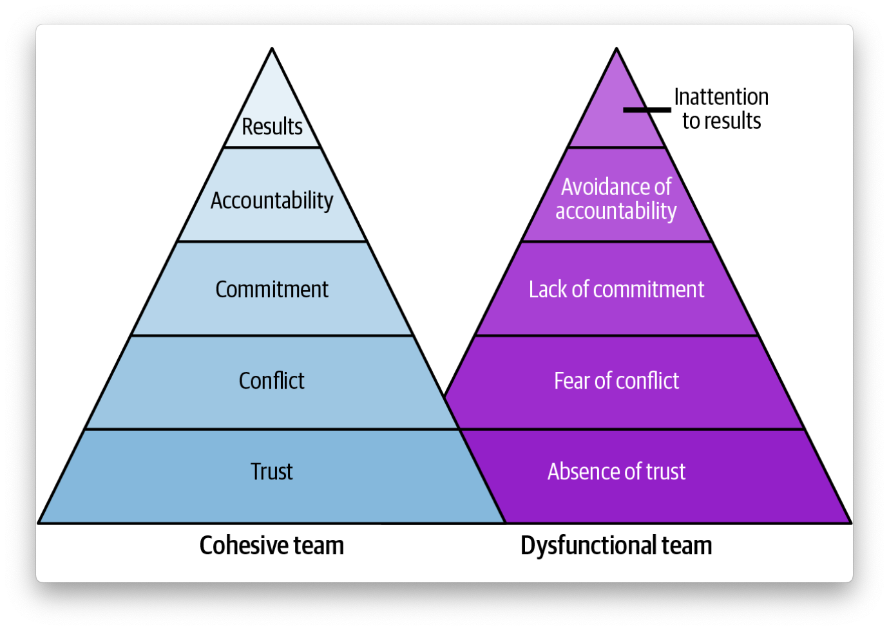

# Chapter 3 - The 3 E’s Model of Effective Engineering

### (Enable → Empower → Expand)

> “Great engineering leadership starts by enabling, is sustained through empowerment, and scales by expanding.”  
> — Addy Osmani

---

## 🧠 Core Idea

The **3 E’s Model** by Addy Osmani presents a scalable leadership approach focused on progressing engineers and teams through three intentional stages:

1. **Enable** – Build confidence, provide structure and clarity.
2. **Empower** – Create space for autonomy and decision-making.
3. **Expand** – Support engineers in scaling their impact and growing others.

This progression is both **individual and organizational**.

---

## 1️⃣ Enable

> “You can’t empower someone who’s not yet confident or clear on expectations.”

### 💡 Goals:
- Build psychological safety
- Provide context, clarity, and structure
- Offer mentorship and reduce ambiguity

### 🛠 How:
- Set clear expectations and success criteria
- Provide feedback early and often
- Pair and support engineers through ambiguity
- Offer learning opportunities without penalty for failure

### 🧠 Mindset:
- Focus on **capability and confidence building**
- Treat failures as learning opportunities
- Safety first → then autonomy

---

### Follow Team Effectiveness Models

*Team effectiveness models* are frameworks or theories that provide a systematic approach to understanding and assessing the factors contributing to high-performing teams.

***Leonioni's model*** focuses on the five dysfunctions that can hinder team effectiveness.

***Tuckman's model***

Todo

## 2️⃣ Empower

> “Empowerment is giving people ownership and trusting their judgment.”

### 💡 Goals:
- Encourage autonomy and self-direction
- Give space to lead initiatives
- Support decision-making at the edge

### 🛠 How:
- Delegate with trust, not micromanagement
- Involve engineers in planning and tradeoff decisions
- Coach rather than control
- Celebrate initiative and accountability

### 🧠 Mindset:
- Shift from *doing for* to *enabling others to do*
- Be available, but not overbearing
- Empowerment ≠ abandonment — stay supportive

---

## 3️⃣ Expand

> “Expansion is how leaders scale leadership.”

### 💡 Goals:
- Multiply leadership through others
- Support engineers in mentoring and influencing
- Foster a culture of ownership and growth

### 🛠 How:
- Encourage engineers to mentor, lead projects, contribute to hiring
- Align career growth with broader team impact
- Recognize and reward those who lift others

### 🧠 Mindset:
- Think long-term: who are you growing into future tech leads, EMs?
- Build a **culture of leadership**, not just a few leaders
- Expansion is how teams scale sustainably

### The Three Always of Leadership

* Always be deciding
* Always be leaving
* Always be scaling

## 🔄 Model in Motion

| Stage   | Needs from Leader                      | Output Looks Like                            |
|---------|----------------------------------------|-----------------------------------------------|
| Enable  | Clarity, support, structure            | Confidence, steady growth                     |
| Empower | Trust, context, space                  | Initiative, ownership                         |
| Expand  | Visibility, growth paths, encouragement| Mentorship, leadership, team-scale thinking   |

## 🧠 Summary

- **Enable** → Build trust, confidence, clarity
- **Empower** → Hand over ownership with support
- **Expand** → Help engineers lead others and scale their impact
- Effective leaders move engineers **through these stages** thoughtfully, and often circle back when new challenges arise

---

## 💬 Key Quotes

> “Leaders who only empower without enabling are setting people up to fail.”  
> “You don’t scale teams by doing more yourself. You scale by growing others.”  
> “Expansion is the compounding effect of trust and growth.”

