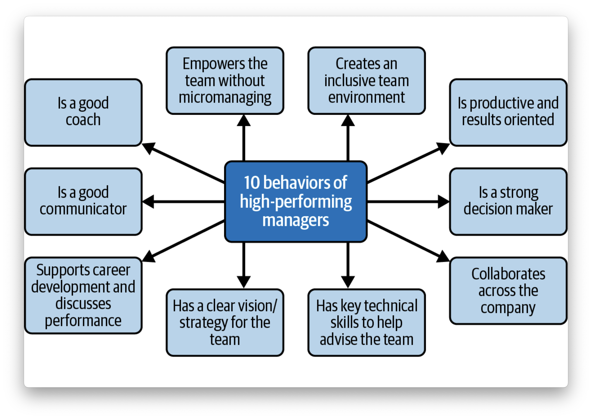

# Chapter 4 - Effective Management Behaviors: Research from Google

## Project Oxygen

Project Oxygen was a research initiative launched by Google in 2008 to identify the qualities of a great manager at Google. The project was led by the People Analytics team—a team of researchers that studies employee data and finds ways to create and maintain a great workplace at Google

### Behaviors of High-Performing Managers

*Is a good coach*

Great managers coach their team members to develop their skills and reach their full potential. Good coaches are patient, empathetic, and supportive. They are self-aware, good listeners, and able to give constructive feedback.

*Empowers team without micromanaging:*

* Offer stretch assignments
* Intervene judiciously and with a light touch
* Encourage autonomy
* Be a cheerleader for your team
* Provide constructive feedback

*Creates an inclusive team environment, showing concern for success and well-being*

* Make new team members feel welcomed
* Build rapport within the team
* Be an enthusiastic cheerleader to support the team
* Role-model civility
* Actively care about, understand, and support team members’ well-being
* Show support in good and bad times
* Create psychological safety on the team

*Is productive and results oriented*

* Assemble a diverse team
* Translate the vision/strategy into measurable goals
* Structure the team and allocate resources to achieve their goals
* Be clear about who owns what
* Remove any roadblocks the team may have
* Be foresighted and plan for potential risks

*Is a good communicator — listens and shares information*

* Encourage open discussion
* Always aim to be responsive
* Share information from leaders and explain the context
* Be honest, even when the truth is unpleasant
* Be calm under pressure
* Listen to other team members.

*Supports career development and discusses performance*

Good managers are honest and open about their expectations, giving the team members plenty of feedback so that they can improve. They don’t wait until performance reviews to give feedback but give it regularly throughout the year. Good managers also give their team members opportunities to grow.

*Has a clear vision/strategy for the team*

* Create a vision/strategy to inspire team members
* Align the team’s vision/strategy with the company’s
* Involve the team in creating the vision where it makes sense
* Clearly communicate the vision, helping the team understand and encouraging questions
* Help the team understand how the overall strategy translates to its work
* Core values
* Purpose
* Mission
* Strategy
* Goals

*Has key technical skills to help advise the team*

*Is a strong decision maker*

* Make decisions efficiently, with the best interests of the business in mind
* Make decisions with an eye toward the situation at hand
* Clearly communicate decision-making rationale

*Collaborates across the company*

Managers collaborate across the business to ensure that their teams work together effectively. They don’t just focus on their departments or teams; they take a more holistic view of the company.