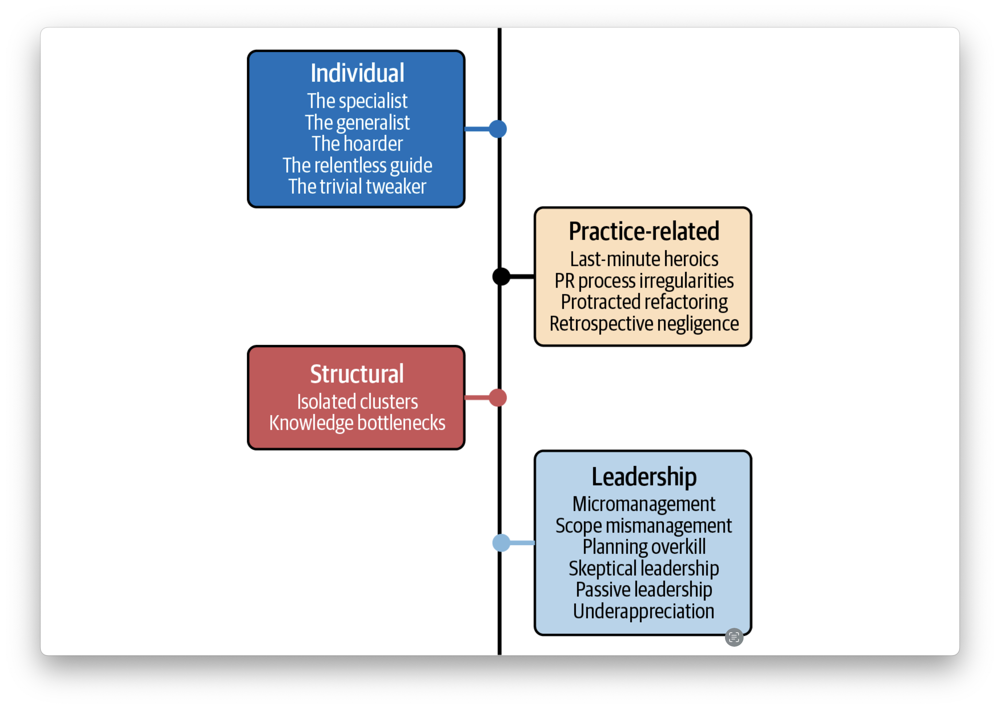

# Chapter 5 - Common Effectiveness Antipatterns

Anipattern categories:

## Individual Antipatterns

*The Specialist*

You have most likely encountered a specialist in one of your teams. This person is most strongly identified with a particular module or feature. They have mastered the ins and outs of that part of the codebase, including small hacks that no one knows about.

Pitfalls:

* Can become indispensable to the team
* It’s impossible to document the micro-knowledge that the specialist possesses
* Some specialists may become rigid and overconfident about their knowledge and ignore valuable feedback
* Limits the individuals professional growth

*The Generalist*

The generalist antipattern arises when an engineer, driven by a desire to diversify their skills and contribute across various domains, spreads themselves too thin and inadvertently compromises depth and expertise in any particular area. While they may intend to become more adaptable, the outcome can be a lack of mastery, focus, and sense of ownership.

Ideally, we want team members to develop a [T-shaped skill](https://en.wikipedia.org/wiki/T-shaped_skills) set where the vertical bar of the T represents their specialization in a specific project area and the horizontal bar represents thir ability to collaborate across different areas of the project.

*The hoarder*

This individual has a unique modus operandi—quietly working away on various tasks during a sprint, withholding updates until they culminate in one colossal PR.

Identifying a hoarder is relatively easy, and you might observe them in the first sprint itself:

* The engineer’s updates are withheld until they accumulate into a substantial pull request.
* Other team members find themselves largely unaware of the hoarder’s ongoing work.
* Code reviews of the hoarder’s sizable pull request become time-consuming and happen so late that you may be unable to devote adequate resources to them, leaving the code under-reviewed.
* The engineer believes their code to be perfect and may not readily accept suggestions to change it to fit better with the rest of the solution.

How to avoid:

* Frequent commits and small pull requests
* Daily mettings to shair their activities
* Frequent code reviews to ensure continious intergration
* Discuss issues with the hoarder directly but gently

*The Relentless Guide*

Some software engineering teams encounter the relentless guide antipattern, characterized by an engineer’s eagerness to offer assistance beyond its intended scope.

The result can hinder the natural progression of skills within the team, leading to a lack of self-sufficiency.

The relentless guide antipattern reminds us to balance helpfulness and self-driven learning.

*The Trivial Tweaker*

The *trivial tweaker antipattern* is one of the more subtle individual antipatterns. These engineers (and their code) do not stand out like a relentless guide or a specialist, nor do they hide like the hoarder. Instead, they regularly deliver small but insignificant changes.

As a team leader, you must help the trivial tweaker get back on track.

## Practice-Related Antipatterns

### Last-Minute Heroics

Last-minute heroics is a practice-related antipattern that can become a trend within a software development team. Issues and challenges are often addressed hastily and heroically just before a release, with minimal time for comprehensive feedback or testing.

Leads to several challangers:

* Lack of feedback
* Hidden technical debt
* Decreaded quality
* Dependency on heroes

How to avoid:

* Effective planning
* Transparent communication
* Prioritized backlog
* Sustainable pace

### PR Process Irregularities

Rubber-stamping, Self-merging, Long-running PRs, Last-minute PRs --> Thorough review and accountability + Diverse Approvals + Timely feedback and closure + Intermediate checkpoints.

### Proctacted Refactoring

A *protracted refactoring antipattern* is characterized by a code refactor that transforms into an enduring process involving one or many engineers. The refactor stretches beyond its expected timeline, either driven by perfectionism or insufficient domain knowledge, leading to a long-running cycle of adjustments beyond initial intentions. As the refactor expands in scope and complexity, it can impede project progress, hamper focus, and foster inefficiencies.

Consider doing the following:

* Indentify the cause
* Set time constraints
* Peer review and closure
* Open communication

### Retrospective Negligence

Several issues can contribute to the diminished effectiveness of retrospectives:

* Missed/delayed retrospectives
* Shortened sessions
* Lack of structure
* Unanimous agreement
* Lack of follow-up

## Structural Antipatterns

### Isolated Clusters

The *isolated clusters antipattern* delves into a situation where subteams or groups form within a larger software development team, leading to insular pockets of collaboration. Within these clusters, members predominantly engage with colleagues from their own subgroups for reviews, help, or informal knowledge sharing. This inadvertently creates barriers to cross-cluster collaboration and hinders the team’s collective progress.

To mitigate the isolated clusters antipattern and promote holistic collaboration, team leaders must encourage the following measures:

* Interdisciplinary sessions
* Rotating roles
* Cross-domain initiatives
* Open communication channels

### Knowledge Bottlenecks

The *knowledge bottlenecks antipattern* highlights a scenario where vital knowledge and expertise become concentrated within a limited number of individuals, resulting in a low bus factor. The *bus factor* is the minimum number of team members required to be incapacitated (hit by a metaphorical bus) before a project faces severe disruption. The pattern often emerges when certain individuals, like the specialist or the relentless guide, become sole repositories of crucial information, creating vulnerabilities for the project’s continuity and stability.

## Leadership Antipatterns

Your actions as an engineering leader can influence most patterns and antipatterns in software engineering teams. But there are cases where the leader’s actions themselves become an antipattern.

### Micromanagement

*Micromanagement* is a much-talked-about leadership antipattern characterized by excessive supervision, where managers exert unnecessary control and oversight over their teams.

Leadership trap:

* Perfectionist bottlenecks
* Prescriptive direction
* Guardians of information

Harms of micromanagement:

* Stifled innovation
* Low morale
* Slowed progress
* Limited growth
* Uniformed dicisions

### Scope Missmanagement

*Scope mismanagement* is a leadership antipattern in which engineering leaders struggle to manage and control the scope of a project. This predicament often arises due to the influx of continuous change requests from product owners or stakeholders, leading to an ever-expanding workload and backlog. As a result, the project becomes mired in uncertainty, hampering progress and causing undue stress for the team, hindering its ability to deliver effectively.

An engineering project should have a well-defined scope and roadmap. While a few change requests are common and reflect well on the team, engineering leaders should know when to stop entertaining such requests.

If you are grappling with inflating scope of your project, there are a few steps you can take to regain control over the project scope:

* Change evaluation process
* Effective communication - with product owners and stakeholders, ensuring the understrand the implications of earch request
* Scope freeze periods - focus on completing existing tasks and stabilizing project progress
* Regular reviews of scope
* Empowered decision making - equip seniors
* **Escalation** - if open communication with product owners does not help and the scope remains volatile, escalate to senior management

### Planning Overkill

The *planning overkill antipattern* characterizes a leadership approach often seen in waterfall software development, where excessive time and effort are invested in the planning and analysis phases.

### Skeptical Leadrship

### Passive Leadership

### Underapprecation

The *underappreciation antipattern* highlights a leadership misstep in which positive traits and behaviors exhibited by team members go unnoticed or underappreciated. This pattern emerges when leaders fail to readily acknowledge and celebrate commendable actions, such as bull’s-eye commits, focused work, or self-motivated code cleanup. By disregarding these virtues, leaders inadvertently dampen team morale, hinder motivation, and miss opportunities to reinforce positive practices.

It is essential that leaders foster a positive environment through the following practices:

* Regular recognition
* Timely feedback
* Public apprecation
