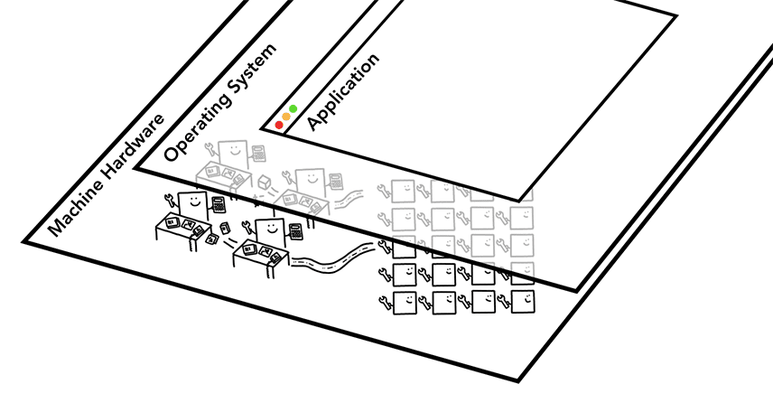

# Inside look at modern web browser

## Part 1

### At the core of the computer are the CPU and GPU.

CPU - Central Processing Unit. CPU can handle many different tasks one by one as they come in. It can handle everything from math to art while knowing how to reply to a customer call. A core is like another CPU living in the same chip.

GPU - Grpahics Processing Unit. Unlike CPU, GPU is good at handling simple tasks but across multiple cores at the same time.

When you start an application on your computer or phone, the CPU and GPU are the ones powering the application. Usually, applications run on the CPU and GPU using mechanisms provided by the Operating System.

<figure><figcaption>Figure 3: Three layers of computer architecture. Machine Hardware at the bottom, Operating System in the middle, and Application on top.</figcaption></figure>

### Executing program on Process and Thread

A process can be described as an application's executing program. A thread is the one that lives inside of process and executes any part of it's process's program.

When you start an application, a process is created. The program might create thread(s) (optional). The Operation System gives the process a "slab" of memory to work with and all application state is kept in that private memory space.

<figure><figcaption>Figure 5: Diagram of a process using memory space and storing application data</figcaption></figure>

A process can ask the Operating System to spin up another process to run different tasks. If two processes need to talk, they can do so by using **I**nter **P**rocess **C**ommunication (**IPC**). 

### Browser Architecture

So how is a web browser built using processes and threads? Well, it could be one process with many different threads or many different processes with a few threads communicating over IPC.

<figure><figcaption>Figure 7: Different browser architectures in process/thread diagram</figcaption></figure>

In Chrome, at the top is the browser process coordinating with other processes that take care of different parts of the application (2nd diagram). For the renderer process, Chrome tries to give each site its own process, including iframes.

#### The benefit of multi-process architucture in Chrome

Chrome uses mutiple renderer process. Each tab has its own renderer process, if one tab becomes unresponsive, you can close this tab and move on while keeping other tabs alive.

Another benefit of separating the browser's work into multiple process is security and sandboxing. Since operating systems provide a way to restrict processes' priviliges.

Because processes have their own private memory space, they often contain copies of common infrastructure (like V8). This means more memory usage. In order to save memory, Chrome puts a imit on how many processes i can spin up (depends on memory and CPU power on device).

### Per-frame renderer processes - Site Isolation

[Source](https://developer.chrome.com/blog/inside-browser-part1/)
