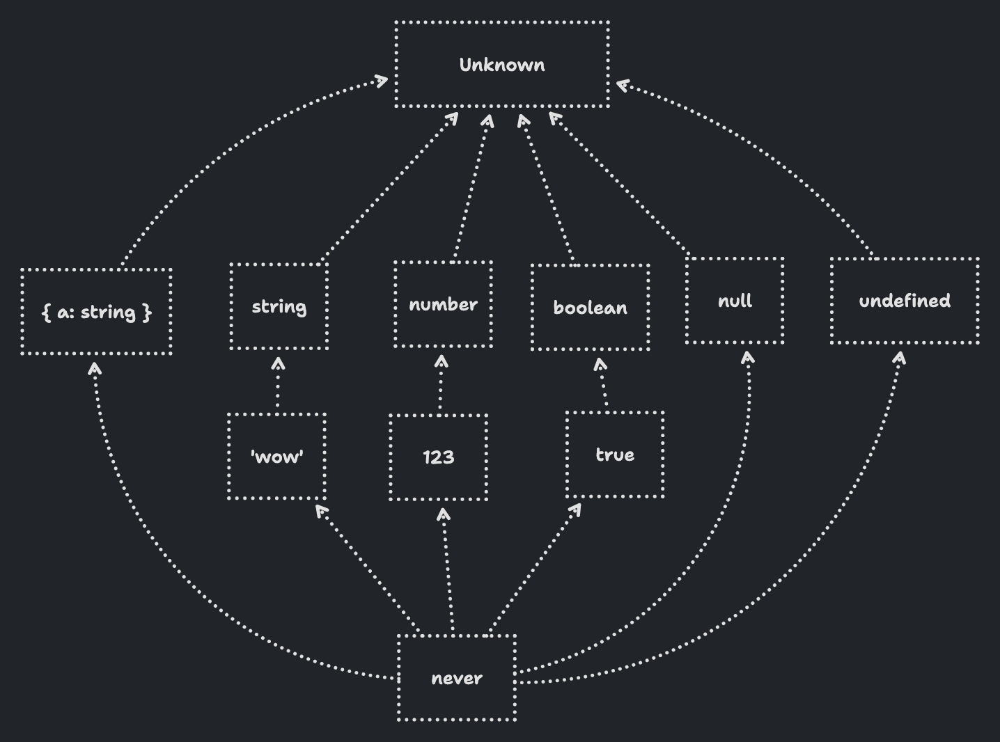

# Unions, Literals, and Narrowing

## Unions and Literals

### Union type

A union type is TypeScript's way of saying that a value can be "either this type or that type".

To create a union type, the `|` operator is used to separate the types. Each type of the union is called a 'member' of the union.

Union types can contain many different types - they don't all have to be primitives, or don't need to be related in any way. 

```ts
type Union = string | number;
```

### Literal type

Just as TypeScript allows us to create union types from multiple types, it also allows us to create types which represent a specific primitive value. These are called literal types.

Literal types can be used to represent strings, numbers, or booleans that have specific values.


```ts
type YesOrNo = 'yes' | 'no'
type StatusCode = 200 | 404 | 500
type TrueOrFalse = true | false
```


## Narrowing

One way we can narrow down the type of a value is to use the `typeof` operator, combined with an `if` statement.
Narrowing only applies within the block's scope.

```ts
const getAlbumYear = (year: string | number | boolean) => {
  if (typeof year === 'string') {
    console.log(`The album was released in ${year}.`) // `year` is string
  } else if (typeof year === 'number') {
    console.log(`The album was released in ${year}.`) // `year` is number | boolean
  }

  console.log(year) // `year` is string | number | boolean
}
```

TypeScript can use other conditional operators like `&&` and `||`, and will take the truthiness into account for coercing the boolean value. It's also possible to use other operators like `instanceof` and `in` for checking object properties.

## `unknown` and `never`

TypeScript's widest type is `unknown`. It represents something that we don't know what it is.

The `unknown` type is the preferred choice when you want to represent something that's truly unknown in JavaScript. For example, it is extremely useful when you have things coming into your application from outside sources, like input from a form or a call to a webhook.

### What's the Difference Between `unknown` and `any`?

They're both wide types, but there's a key difference.

`any` doesn't really fit into our definition of 'wide' and 'narrow' types. It breaks the type system. It's not really a type at all - it's a way of opting out of TypeScript's type checking.

`any` can be assigned to anything, and anything can be assigned to any. any is both narrower and wider than every other type.

`unknown`, on the other hand, is part of TypeScript's type system. It's wider than every other type, so it can't be assigned to anything.

This means that `unknown` is a safe type, but any is not. `unknown` means "I don't know what this is", while `any` means "I don't care what this is".

### The Narrowest Type: `never`

If `unknown` is the widest type in TypeScript, never is the narrowest.

`never` represents something that will *never* happen. It's the very bottom of the type hierarchy.

You'll rarely use a `never` type annotation yourself. Instead, it'll pop up in error messages and hovers - often when narrowing.



## Discriminated Unions

A discriminated union is a type that has a common property, the 'discriminant', which is a literal type that is unique to each member of the union.

### The Problem: The Bag of Optionals

Let's imagine we are modelling a data fetch. We have a `State` type with a status property which can be in one of three states: `loading`, `success`, or `error`.


```ts
type State = {
  status: 'loading' | 'success' | 'error'
}
```

This is useful, but we also need to capture some extra data. The data coming back from the fetch, or the error message if the fetch fails.

We could add an error and data property to the `State` type:

```ts
type State = {
  status: 'loading' | 'success' | 'error'
  error?: string
  data?: string
}
```

...but we need to tighten it up so that `error` can only happen on `error`, and `data` can only happen on `success`.

```ts
const state: State = {
  status: 'loading',
  error: 'This is an error', // should not happen on "loading!"
  data: 'This is data', // should not happen on "loading!"
}
```

so, we can use discriminated union for this:

```ts
type State =
  | {
      status: 'loading'
    }
  | {
      status: 'error'
      error: string
    }
  | {
      status: 'success'
      data: string
    }
```